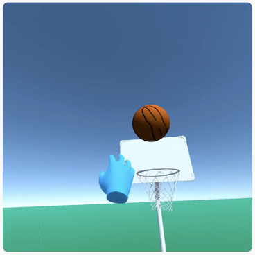

# Simpelt VR spil i Unity

Dette er vejledning til at lave et VR basketball spil til Oculus Quest 2 VR headset. 



## Forberedelse

1. Installer Unity 2022.2 med Android support
1. Opret 3D core project
1. Sæt rotation for `Directional Light` til `(50, -150, -150)`
1. Åbn `Window -> Package Manager` og importer `XR Interaction Toolkit` pakke
1. Åbn `File -> Build Setting...` og skift til `Android`
1. Åbn `Player Settings` og
  - Angiv et projekt navn, f.eks. `com.companyname.vr`
  - Vælg `Settings -> XR Plugin Management` settings og installer pakke
  - Sæt `Quality` level `High` default
1. Importér [XR Origin.unitypackage](<XR Origin.unitypackage>)
1. Importér [Basketball Hoop Materials.unitypackage](<Basketball Hoop Materials.unitypackage>)

## Simpel græsplæne

1. Opret `3D Object -> Plane`, navngiv det `Grass` og sæt størrelsen til f.eks. `(50, 50, 1)`
1. Under `Materials` mappen i Project View, oprettes nyt Material "Grass", som gives en passende grøn farve. Træk materialet over på plane

## Sæt XR rig op

1. Drag/drop `XR Origin` and `XR Interaction Manager` prefabs, som indeholder XR rig og hænder
1. Fjen det original kamera fra scenen, da vi har kamera i XR rig

## Basketball

Vi laver en simpel basketball fra bunden

1. Opret `3D Object -> Sphere`
1. Træk `Basketball Texture` over på bolden
1. Tilføj `Sphere Collider`
1. Sæt størrelse til `(0.35, 0.35, 0.35)` (= 35 cm)
1. Tilføj `XR Grab Interactable` komponent, og sæt `Colliders` og `Attach Transform` til bolden selv
1. Opret `Physics` mappe med nyt `Physic Material` som f.eks. navngives `Basketball`. Sæt `Bounciness` til `0.8` og vælg `Max bounciness`

Kør spillet i Playmode i editor, og se at bolden hopper

1. Få ChatGPT til at skrive et C# script som får bolden til at respawn'e når længere end 3 meter væk
   ```
   unity c# script basketball respawn at origin when more than 3 meters away and set velocity to zero
   ```

## Basket kurv

1. Træk `Models/Hoop/basketball-hoop-001` ind i scenen
1. Placer i `(0, 0, -2)`
1. Tilføj mesh colliders til base, hoop og board
1. Tilføj materials

## Spil spillet :)

1. Åbn `Build Setting` vindue, og vælg dit Oculus headset i `Run Device`
1. Tryk `Build and Run`, og spillet bliver bygget og overført til dit headset


## Referencer

- `Hands Unity Package` fra [How To Make A VR Game In Unity - Part One: Setup & Gun](https://www.youtube.com/watch?v=EjKvB9YQQY8)
- [Basketkurv 3D model](https://www.freepik.com/3d-model/basketball-hoop-001_164.htm)
- [Basketball texture](https://www.robinwood.com/Catalog/FreeStuff/Textures/TexturePages/BallMaps.html)
